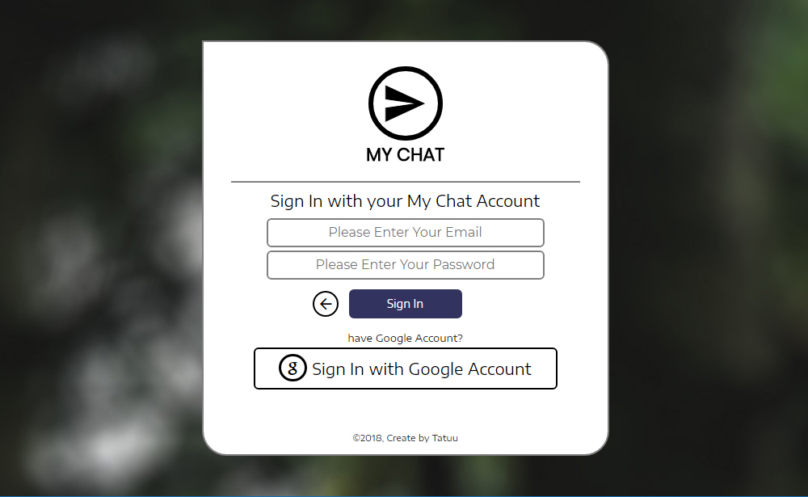
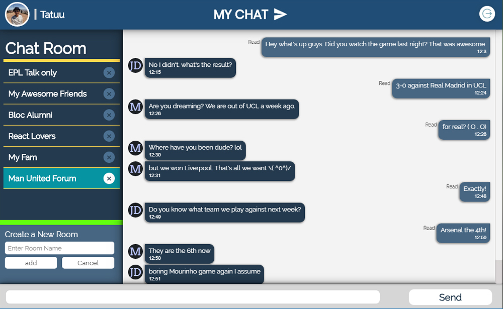

# My Chat
My Chat is a web chat application allow user to exchange text message and create rooms of conversation between registered user.

*Note: This is application is in the process of development*

## User guide

#### Registration
User can registration by create new My Chat account using and existing email or sign up with your Google account.

After login, My Chat will redirect user to main page which can be able to view chat rooms, display and sending messages with in active room. Create and delete room.

## Version
v0.01

## Demo
You can checkout My Chat by follow this link [here](https://tatuu-mychat.netlify.com). 

## Sending Feedback
I am always open to [your feedback](https://github.com/bakhumhlea/My-Chat-React/issues).
